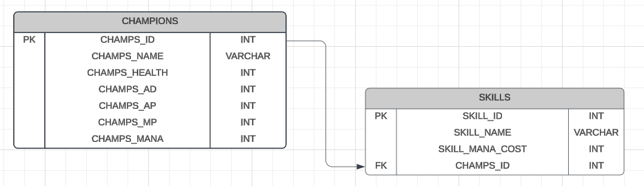

# proyecto FastLOL


[FastAPI](https://fastapi.tiangolo.com/#installation)

[CORS (Cross-Origin Resource Sharing) - FastAPI](https://fastapi.tiangolo.com/tutorial/cors/)

# como conectar postgres con pgadmin - docker compose

- fue creado el sigt archivo de docker compose

```docker
services:
  db:
    container_name: postgres-lol #hostname
    image: postgres #nombre de la bd
    restart: always
    ports:
      - 5432:5432
    volumes:
      - postgres-data:/var/lib/postgresql/data
    environment:
      - POSTGRES_USER=tubarao #postgres
      - POSTGRES_PASSWORD=123456
      - POSTGRES_DB=Lol
    
#el volumen se le pone ./ para decir que asi se llamara la carpeta y se
#almacene ahi mismo los datos esto evita agregar nuevamente el volumen

  pdAdmin:
    image: dpage/pgadmin4
    container_name: pgadmin4
    restart: always
    depends_on:
      - db
    ports:
      - 8080:80
    environment:
      - PGADMIN_DEFAULT_EMAIL=tubarao@gmail.com
      - PGADMIN_DEFAULT_PASSWORD=123456
    volumes:
      - pgadmin:/var/lib/pgadmin
      - pgadmin:/certs/server.cert
      - pgadmin:/certs/server.key
      - pgadmin:/pgadmin4/servers.json
    
volumes:
  postgres-data:
  pgadmin:
```

- se puede apreciar que en la bd creada con postgres se agregaron variables de entorno para darle datos especificos y no por defecto a la base de datos creada, la contraseña y el usuario
- tanto pgadmin como postgres se conectan por medio de sus puertos correspondientes abiertos en el localhost entre aun asi cada unos guarda sus datos en volumenes diferentes de forma practicamente interna en docker para evitar el almacenamiento de los datos de cada volumen dentro de la carpeta del proyecto

## Creacion de base de datos



- aqui se tiene en cuenta los datos que se quieren extraer y estrapolar del juego a la base de datos en especifico, el cual se realiza en un diagrama de entidad relacion para hacerlo mas entendible a la hora de traspasarlo a la bd
- posteriormente se pasan a codigo de postgres y luego se insertan los primeros 5 datos obtenidos para posteriores testeos tanto de la bd como de la api

```python
CREATE TABLE "CHAMPIONS" (
  "CHAMPS_ID" SERIAL PRIMARY KEY,
  "CHAMPS_NAME" VARCHAR,
  "CHAMPS_HEALTH" INT,
  "CHAMPS_AD" INT,
  "CHAMPS_AP" INT,
  "CHAMPS_MP" INT,
  "CHAMPS_MANA" INT
);

CREATE TABLE "SKILLS" (
  "SKILL_ID" SERIAL PRIMARY KEY,
  "SKILL_NAME" VARCHAR,
  "SKILL_MANA_COST" INT,
  "CHAMPS_ID" INT NOT NULL,
  CONSTRAINT "CHAMPS_FK" FOREIGN KEY ("CHAMPS_ID") REFERENCES "CHAMPIONS"("CHAMPS_ID")
  ON DELETE CASCADE 
  ON UPDATE CASCADE
);
```

> **⚠️** *no agregar o insertar datos a los id cuando son autoincrementables o desincronizan las tablas en las bases de datos sobretodo postgres, lo cual puede traer problemas a futuro a la hora de manipular datos por medio de la api.*
> 

```sql
#datos de personajes
INSERT INTO "CHAMPIONS" ("CHAMPS_NAME", "CHAMPS_HEALTH", "CHAMPS_AD", "CHAMPS_AP", "CHAMPS_MP", 
"CHAMPS_MANA")
VALUES 
('Ekko', 665, 58, 9, 340, 280),
('Kennen', 590, 48, 9, 523, 200);

#datos de sus habilidades
INSERT INTO "SKILLS" ("SKILL_NAME", "SKILL_MANA_COST", "CHAMPS_ID")
VALUES
('rebobinador de tiempo', 50, 1),
('convergencia paralela', 30, 1);
```

- primero se busca agregar las librerias necesarias en el entorno para poder trabajar tales como venv en fedora linux

```python
python -m venv venv
source venv/bin/activate
```

- instalacion de librerias como fastapi segun su documentacion mas actual

# Primeros pasos

extensiones de vscode a tener en cuenta:

- thunder client, el cual sirve para testear el backend y request justo como postman

### Comandos de instalacion

- primero se crea un entorno virtual venv
    
    ```python
    #python -m venv <nombre_del_entorno> (generalmente se le pone venv)
    python3 -m venv venv
    ```
    
- para activar el entorno
    
    ```python
    #source <nombre_del_entorno>/bin/activate (en este caso venv)
    source local/bin/activate
    ```
    
- para instalar paquetes con pip
    
    ```python
    #pip install <paquete>
    #con los == se especifica que version se quiere
    pip install "fastapi[standard]"
    ```
    
- para desactivar el entorno virtual venv
    
    ```python
    deactivate
    ```
    
- para correr el servidor
    
    ```python
    fastapi dev main.py
    ```
    

# como conectar postgres con fastapi

[Psycopg – PostgreSQL database adapter for Python — Psycopg 2.9.10 documentation](https://www.psycopg.org/docs/)

para realizar dicha conexion sera necesario instalar la libreria **PSYCOPG2** la cual se especializa desde hace tiempo en conexiones de bd de python con postgres

### para instalar psycopg2

```python
pip install psycopg2-binary
```

- no es necesario agregarle nada ya que a diferencia de su version 2, la version 3 no finaliza en su instalacion asi como tal

[Psycopg2 para acceder a una base de datos PostGIS con Python](https://geoinnova.org/blog-territorio/libreria-psycopg2-para-acceder-a-una-base-de-datos-postgis-con-python/)

### para crear una conexion con la bd de postgres

```python
#connection.py
import psycopg2

#1
postgres_config = {
    'host':'localhost',
    'port':'5432',
    'user':'tubarao',
    'database':'Lol',
    'password':'123456'
}
#2

conn = psycopg2.connect(**postgres_config)
#3

#4
def get_connection():
    return conn
```

1. se detallan los datos de la conexion dentro de un diccionario que se llamara previamente
2. a diferencia de mysql en postgres no es necesario usar 'auth_plugin':'mysql_native_password' 
3. para no tener que describir todas las propiedades de postgres_config se le pone, los dos **, para que la funcion misma lo descomponga
4. funcion para regresar la conexion
- luego se crea un modelado de la bd creada en postgres por medio de pydantic para mas adelante hacer consultas

```python
#champions.py
from pydantic import BaseModel

#se importa pydantic y se crea una clase
#la cual creara un modelo basado en la bd representado en clases de python
class Champ(BaseModel):
    CHAMPS_NAME: str
    CHAMPS_HEALTH: int
    CHAMPS_AD: int
    CHAMPS_AP: int
    CHAMPS_MP: int
    CHAMPS_MANA: int

class Skill(BaseModel):
    SKILL_NAME: str
    SKILL_MANA_COST: int
    CHAMPS_ID: int
```

### cursor

Es un objeto que te permite interactuar con una base de datos.

sirve para:

- **Recuperar datos**: El cursor te permite ejecutar consultas (como `SELECT` en SQL) y obtener los resultados.
- **Modificar datos**: Puedes usar el cursor para insertar, actualizar o eliminar registros en la base de datos.
- **Navegar**: El cursor te permite moverte por los resultados de una consulta, fila por fila.

## Get

```python
@app.get('/champs')
async def get_champs():
    cursor = conn.cursor(cursor_factory=psycopg2.extras.RealDictCursor)#1
    query = 'SELECT * FROM "CHAMPIONS"'

    try:#2
        cursor.execute(query)#3
        champs = cursor.fetchall()#4
        return champs #5
    except psycopg2.Error as err:#6
        raise HTTPException(status_code=500, detail=f"error al conectar con postgres: {err}")
    finally:#7
        cursor.close()#8
```

1. regresar datos en Json en formato de psicopg2 para consulta de postgres, es necesario importar antes `import psycopg2.extras`
2. intentar, para controlar los posibles fallos en consulta
3. traer datos en especifico de la bd
4. almacenar los datos pedidos dentro de champs
5. mostrar dichos datos almacenados
6. error al ejecutar el intento
7. se ejecuta independiente de si funciono o no el try
8. como buena practica se cierra el cursor o consulta
- raise se usa para agregar excepciones personalizadas con python
- si las tablas en postgres se crearon en mayusculas es necesario tener en cuenta llamarlas por medio de comillas dobles `“ “` sino postgres lo leera como si estuviesen en minusculas por ende es mejor tener el resto del query en comillas simples

## post

```python
@app.post('/champ')
async def create_champ(champ:Champ):# 1
    cursor = conn.cursor()#2
    query = query = 'INSERT INTO "CHAMPIONS" "CHAMPIONS" ("CHAMPS_ID", "CHAMPS_NAME", "CHAMPS_HEALTH", "CHAMPS_AD", "CHAMPS_AP", "CHAMPS_MP", "CHAMPS_MANA") VALUES(%s,%s,%s,%s,%s,%s)'
    values = (champ.CHAMPS_NAME, champ.CHAMPS_HEALTH, champ.CHAMPS_AD, champ.CHAMPS_AP, champ.CHAMPS_MP, champ.CHAMPS_MANA)
    #3
    try:
        cursor.execute(query, values)
        conn.commit()#4
        return {"message":"Champ agregado correctamente"}
    except psycopg2.Error as err:
        raise HTTPException(status_code=500, detail=f"Error al agregar el champion: {err}")
    except ValueError as e:#5
        raise HTTPException(status_code=403, detail=f"Error al en algun dato a guardar del champion:{e}")
    finally:
        cursor.close()
```

1. se crea una variable que almacene lo de pydantic
2. conexion con bd
3. se crea values con el fin de no rellenar info de mas en el try y pasarle solo una variable
4. hace que la info sea persistente en la bd
5. se usa cuando hubo un error de un dato digitado sea por el tipo

## put

```python
@app.put('/champ/{id}')
async def update_champ(champ:Champ, id:int):
    cursor = conn.cursor(cursor_factory=psycopg2.extras.RealDictCursor)#conexion con bd
    query = """UPDATE "CHAMPIONS"
    SET "CHAMPS_NAME" = %s,
    "CHAMPS_HEALTH" = %s,
    "CHAMPS_AD" = %s,
    "CHAMPS_AP" = %s,
    "CHAMPS_MP" = %s,
    "CHAMPS_MANA" = %s
    WHERE "CHAMPS_ID" = %s;"""
    
    values = (champ.CHAMPS_NAME,
            champ.CHAMPS_HEALTH,
            champ.CHAMPS_AD,
            champ.CHAMPS_AP,
            champ.CHAMPS_MP,
            champ.CHAMPS_MANA,
            id)
    
    try:
        cursor.execute(query, values)
        conn.commit()
        return {"message":"Champ actualizado correctamente"}
    except psycopg2.Error as err:
        raise HTTPException(status_code=500, detail=f"Error al agregar el champion: {err}")
    except ValueError as e:
        raise HTTPException(status_code=403, detail=f"Error al en algun dato a guardar del champion:{e}")
    finally:
        cursor.close()
        conn.close()
```

## Delete

```python
@app.delete('/champ/{id}')
async def delete_champ(id:int):
    cursor = conn.cursor(cursor_factory=psycopg2.extras.RealDictCursor)
    query = """DELETE FROM "CHAMPIONS" WHERE "CHAMPS_ID" = %s;"""
    values = (id) 
    try:
        cursor.execute(query, values)
        conn.commit()
        return {"message":"usuario eliminado correctamente"}
    except psycopg2.Error as err:
        raise HTTPException(status_code=500, detail=f"Error al eliminar el champion: {err}")
    except ValueError as e:
        raise HTTPException(status_code=403, detail=f"Error al en algun dato a eliminar del champion:{e}")
    finally:
        cursor.close()
        conn.close()
```

# Para deshabilitar el bloqueo por medio de cors

este es el bloqueo de seguridad de acceso a la api que tiene implementado de base fastapi para evitar accesos o permisos a cualquier pagina del front que quiera realizar peticiones sin dicho consentimiento

```python
from fastapi.middleware.cors import CORSMiddleware

app.add_middleware(
    CORSMiddleware,
    allow_origins=origins,
    allow_credentials=True,
    allow_methods=["*"],
    allow_headers=["*"],
)
```

- para realizarlo se debe importar la libreria del middleware el cual funge como una especie de proxy o mediador en la web en un proyecto de frontend y el que se haya creado en el backend con fastapi en este caso
- donde en la parte de origins se debe especificar que rutas o IP tienen permitido realizar peticiones a la api en el caso de ser un proyecto probandose en local se realiza el sigt cambio

```python
app.add_middleware(
    CORSMiddleware,
    allow_origins=["*"],
    allow_credentials=True,
    allow_methods=["*"],
    allow_headers=["*"],
)
```

- donde en la parte origins al trabajar en local como se menciono se agrega la info con el asterisco haciendo alucion a que seran permitidas todas las peticiones realizadas lo cual en entornos empresariales sera algo mas especifico y totalmente diferente con llamados de IP o rutas fijas con cierto enfasis en los demas atributos que contiene un middleware

## Estructura de carpetas vertical slice architecture estilo onion

- **core:** Contiene la configuración principal de tu aplicación. Es el "núcleo" que conecta todo.
    - **configs**: configuraciones globales para la app, como llaves y conexiones, Llaves secretas (`SECRET_KEY`). Conexiones a servicios externos (bases de datos, APIs). Configuraciones de frameworks como FastAPI o Celery.
    - **databases:**
        - **managers:** Clases o funciones que gestionan transacciones complejas o interacciones avanzadas con la base de datos. Ejemplo: "Guardar un usuario y sus roles en una sola transacción."
        - **models:** aqui se almacenan las consultas a la base de datos dividido en archivos que consultan cada tabla de forma orm como sqlalquemist, Modelos ORM para mapear las tablas de la base de datos. Divide por archivos según las tablas (por ejemplo, `users.py`, `orders.py`).
    - **middlewares**: autenticacion y analisis de peticiones, donde se limitan las peticiones ya que es la capa intermediaria entre las peticiones y la api, Esta carpeta contiene middleware que se ejecuta antes o después de las solicitudes. **Autenticación:** Verificar tokens o sesiones. **Rate-limiting:** Limitar el número de solicitudes por usuario o IP. **Logs:** Registrar las solicitudes o respuestas.
    - **modules:** donde se crean las apps o apis como en django se separa por carpetas lo que hace cada una como Aquí es donde desarrollas funcionalidades específicas, separadas por contexto o módulo. ej: administracion, autenticacion, etc. donde dentro tienen unas subcarpetas ej:
        - `autenticacion:`
            - `login`
            - `forgot_password`
            - `register`
        - **`login/`**:
            - **`services.py`**: Lógica para manejar inicios de sesión.
            - **`routes.py`**: Rutas específicas para el login (endpoints).
            - **`tests.py`**: Pruebas unitarias para este módulo.
        - **`register/`**:
            - Similar estructura, pero enfocada en registros.
    - **utils**: utilidades externas u offtopic de la aplicacion principal como añadiduras, Para funciones y utilidades generales que no están directamente ligadas a una funcionalidad principal.
        - Funciones reutilizables (validación de emails, generación de hashes, etc.).
        - Decoradores personalizados.
        - Manejadores genéricos de errores.
        
    
    > El __init__.py convierte las carpetas en modulos
    > 

## Codigos de status http

**200 - 299:** fue bien la cosa o todo lo ejecutado a ido perfecto (se debe aclarar que luego del 206 el resto de codigos pueden asignarseles detalles especificos ya que estaran vacios pero listos para asignar algun tipo de valor)

**300-399:** redireccion de mensajes

**400 - 499:** errores del cliente

**500 - 599:** errores en el servidor
